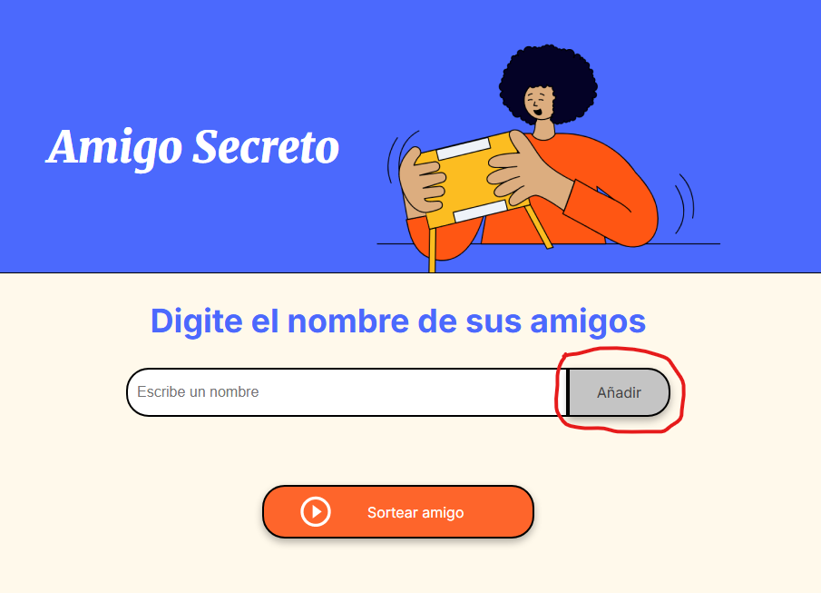
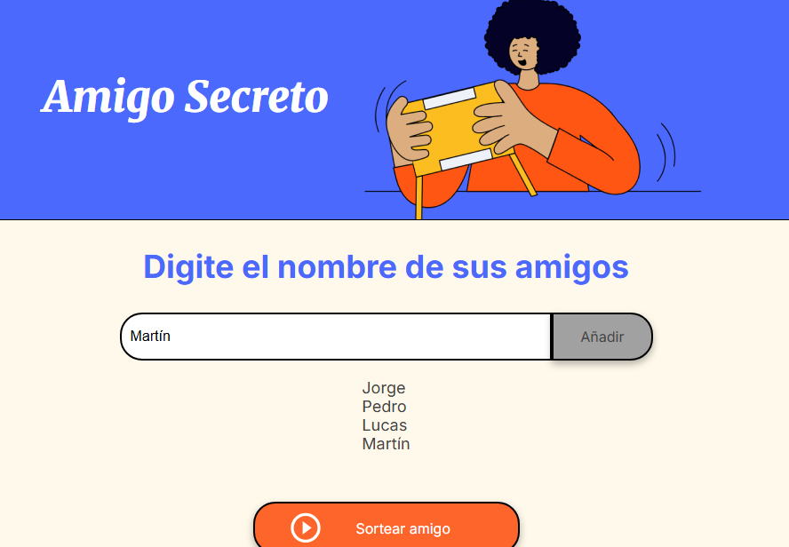

# Amigo
Juego del Amigo Invisible
# Juego de Amigo Secreto

¡Bienvenido al juego de Amigo Secreto! Este programa te permite sortear un amigo secreto de manera fácil y divertida.

---

## Requisitos del sistema

Antes de empezar, asegúrate de que cumples con los siguientes requisitos:
- Un navegador web moderno como Google Chrome, Mozilla Firefox, Microsoft Edge, etc.
- Acceso a una computadora o dispositivo móvil.

---

## Archivos del programa

El programa incluye los siguientes archivos:

1. `index.html` - Estructura principal del juego.
2. `style.css` - Estilos para el diseño de la página.
3. `app.js` - Lógica del juego en JavaScript.
4. `assets/` - Carpeta que contiene imágenes para el programa (opcional).

---

## Instalación y uso

### Paso 1: Descargar los archivos

Descarga el proyecto completo desde este repositorio.

Si estás utilizando una computadora:
1. Haz clic en el botón verde de **Code** en la parte superior del repositorio.
2. Selecciona **Download ZIP** para descargar todos los archivos como un paquete comprimido.
3. Descomprime el archivo ZIP en una carpeta de tu elección.

### Paso 2: Abrir el programa

1. Busca el archivo llamado `index.html` en la carpeta descomprimida.
2. Haz doble clic en el archivo. Esto abrirá el programa automáticamente en tu navegador web.

**Nota:** No necesitas instalar software adicional. Todo lo que necesitas está listo para funcionar.

### Paso 3: Usar el juego

Sigue estos sencillos pasos para utilizar el programa:

#### 1. **Agregar nombres**
- Escribe el nombre de un amigo en el cuadro de texto que dice "Escribe un nombre".
- Haz clic en el botón **Adicionar** para agregarlo a la lista de participantes.

#### 2. **Ver la lista de participantes**
- A medida que agregues nombres, estos aparecerán automáticamente en la lista debajo.

#### 3. **Sortear un amigo secreto**
- Una vez que todos los nombres hayan sido agregados, haz clic en el botón **Sortear amigo**.
- El programa seleccionará un amigo secreto al azar y mostrará el resultado en pantalla.

---

## Características adicionales

- **Interfaz amigable:** El diseño del programa es simple y colorido para facilitar su uso.
- **Validación:** Si intentas agregar un nombre vacío, el programa mostrará una alerta pidiéndote que escribas un nombre válido.

---

## Solución de problemas

1. **No veo el resultado del sorteo:** Asegúrate de haber agregado al menos un nombre antes de hacer clic en el botón **Sortear amigo**.
2. **No aparece nada en mi navegador:** Verifica que abriste el archivo `index.html` en tu navegador.

---

¡Espero que disfrutes usando el programa! Si tienes algún problema, no dudes en ponerte en contacto para recibir ayuda. 😊
